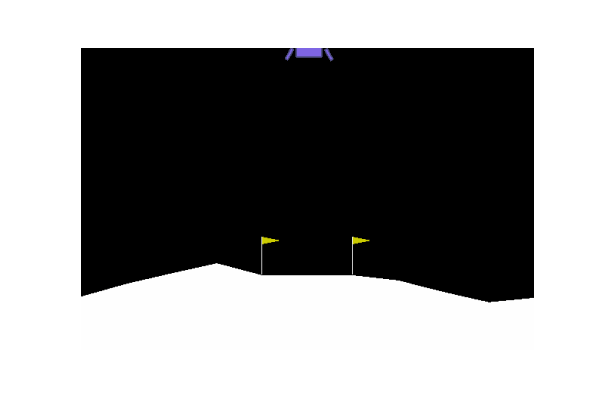

# Simple Deep Q Learning

Introduction to Making a Simple Game AI with Deep Reinforcement Learning

This is an example of a Cartpole and Lunar Landing envoriments from [Gym](https://gym.openai.com/) through the use of DQN Jupyter notebook, for AI class at the School of Engineering, Universidad Autónoma de Chihuahua.

This repository was taken and edited from Keon Kim's [work](https://github.com/keon/deep-q-learning).

**Carpole Result**

**Lunar Landing Result**

[Jorge Pizaña](https://github.com/JorgePizana) and [Oscar Ordoñez](https://github.com/OscarOK)